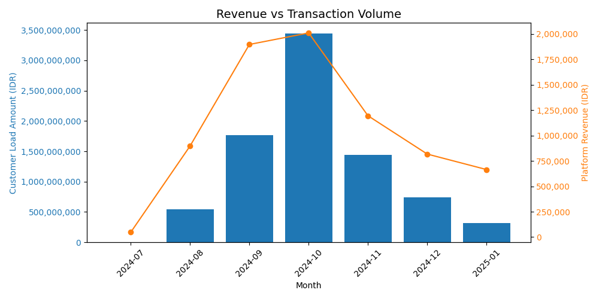

# FinTech “Duitku” Wallet Top-Up Analytics  
**Customer Behavior • Cohorts • LTV • Revenue Forecasting**

Python analysis of real **Duitku** digital wallet top-up transactions.  
This project extracts behavioral insights, builds customer cohorts, models LTV, and forecasts monthly revenue.  
An end-to-end FinTech analytics workflow built from raw transactions to business-ready insights.

**Dataset Coverage:**  
Transactions in this dataset span **July 18, 2024 → January 24, 2025**, representing ~6 months of real digital wallet top-up activity. This rolling-window time range mirrors how FinTech companies typically analyze recent user behavior, revenue trends, and cohort performance.

---

 

## Project Summary

This project analyzes real transaction-level data from a digital wallet system to understand:

- How users fund their accounts  
- How customer value evolves over time  
- How monthly revenue can be forecasted  

Using Python, the analysis covers:

- Behavioral insights  
- Cohort dynamics  
- Customer lifetime value (LTV) modeling  
- Time-series revenue forecasting  

The goal is to support real-world FinTech decision-making with clear, data-driven insights.

---

 

## Dataset

The original dataset can be downloaded here:

**[transactions.xlsx (Zenodo)](https://zenodo.org/records/17092322/files/transactions.xlsx?download=1)**

Full detailed data dictionary:  
**[Full Data Dictionary](docs/data_dictionary_full.md)**

---

 

Fields / Columns that are un-necessary were deleted, leaving these :

## 📊 Key Fields (Compact Data Dictionary)

These fields represent the core attributes used for cohort analysis, LTV modeling, customer segmentation, and revenue forecasting:
| Field                       | Description                                                                  |
|-----------------------------|------------------------------------------------------------------------------|
| **id**                      | Unique internal transaction ID (primary key).                               |
| **customer_id**             | Unique customer identifier for segmentation, cohorts, and LTV.              |
| **net_amount**              | Total top-up value credited to the wallet (transaction volume, not revenue).|
| **fee_internal_amount**     | Platform’s internal fee revenue per transaction (used for LTV).             |
| **fee_external_amount**     | Fee paid to banks/payment partners (reduces net revenue).                   |
| **category**                | Bank/payment category used (BRI, BNI, Mandiri).                             |
| **transaction_date**        | Timestamp of completed top-up transaction (used for recency, cohorts, forecasting). |
| **year_month**              | Derived monthly period (`YYYY-MM`) used for aggregation and trend analysis. |
| **cohort_month**            | Derived field indicating the customer’s first transaction month (used for cohorts). |
| **created_at**              | System timestamp for record creation.                                       |

---

 

From those, there are two helper columns generated : 

## 🔧 Derived Date Columns (Feature Engineering)

These analytical fields were engineered from the raw `paying_at` timestamp to enable monthly trend analysis, cohort grouping, and forecasting:

| Column           | Description                                                              |
|------------------|--------------------------------------------------------------------------|
| **year_month**   | `YYYY-MM` format used for monthly aggregation and time-series analysis.  |
| **cohort_month** | The customer’s first transaction month, used to assign cohort groups.    |

These features do not exist in the raw dataset—they were created to support cohort analysis, LTV modeling, revenue trends, and actionable business insights.

  

---

# Platform Scale and Momentum

### 01 — Monthly Platform Usage Volume  
**Business question:**  
*How much money flows through the platform each month, and is usage momentum sustained?*

#### Method
- Aggregate monthly wallet top-up volume (`net_amount`)
- Group transactions by `year_month`
- Measure total platform usage (not revenue)

  

#### Key Insights
- Platform usage **ramped rapidly** from August to October, peaking in October (~3.4B IDR)
- Usage **declined consistently** from November through January
- Indicates strong early adoption but **weak usage sustainability**
- Suggests growth driven by a short-term surge rather than durable retention
- 
  
---
  

### 02 — Monthly Revenue and Performance Growth  
**Business question:**  
*Is platform revenue growing sustainably month-to-month, and where does momentum break?*

#### Method
- Aggregate monthly platform revenue using `fee_internal_amount`
- Group transactions by `year_month`
- Visualize:
  - **Bars:** total monthly revenue (IDR)
  - **Line:** month-over-month (MoM) revenue growth (capped to reduce distortion)

  

#### Key Insights
- Revenue **scaled rapidly from August to October**, peaking in October (~2.0B IDR)
- **MoM growth spikes early**, then collapses after October
- Revenue **drops sharply in November**, followed by weaker recovery
- Growth turns **negative post-peak**, signaling loss of platform momentum

  
---
  

## 03 — Revenue vs Transaction Volume  
**Business question:**  
*Is revenue growth driven by higher transaction volume, or by improved monetization efficiency?*

#### Method
- Aggregate monthly **transaction volume** using `net_amount`
- Aggregate monthly **platform revenue** using `fee_internal_amount`
- Group data by `year_month`
- Visualize:
  - **Bars:** total customer load / transaction volume (IDR)
  - **Line:** platform revenue (IDR)

  

#### Key Insights
- Revenue closely **tracks transaction volume** across all months
- Peak revenue and volume both occur in **October**
- Post-October decline shows **no monetization offset** (revenue falls with volume)
- Indicates revenue is **volume-dependent**, not efficiency-driven

#### Interpretation
- Platform monetization is linear: more usage = more revenue
- No evidence of pricing power or fee optimization during slowdown
- Growth risk is high unless **retention or per-transaction value improves**

