# FinTech “Duitku” Wallet Transaction Analytics  
**Customer Behavior • LTV • Revenue Forecasting**

## How to read this project :
This analysis is structured to move from overall platform performance, to customer retention and value, and finally to business risks and recommendations. Each section builds on the previous to explain why revenue declined and what actions matter most.

## About this project :
Python analysis of real **Duitku** digital wallet top-up transactions.  
This project extracts behavioral insights, builds customer cohorts, models LTV, and forecasts monthly revenue.  
It is an end-to-end FinTech analytics workflow built from raw transactions to business-ready insights.

## Limitations:
This analysis is based on ~6 months of post-launch data. Results reflect early-stage behavior and should be revalidated as usage patterns stabilize.

## Dataset:  
- Transactions in this dataset span **July 18, 2024 → January 24, 2025**, representing ~6 months of real digital wallet top-up activity. This rolling-window time range mirrors how FinTech companies typically analyze recent user behavior, revenue trends, and cohort performance.
- The dataset reflects real transaction-level behavior from a production digital wallet environment, anonymized and cleaned for analytical use.

## Executive Summary :

**Performance**
- Platform usage and revenue grew rapidly post-launch, then declined steadily after October
- Revenue tracks usage closely, indicating volume-driven economics rather than pricing effects

**Customer Behavior**
- Most customers churn shortly after their first transaction
- Later cohorts generate less value than early cohorts, even when active
- A small group of high-value users drives a meaningful share of revenue

**Core Business Issue**
- Weak early retention, not acquisition volume, is the primary constraint on growth
- Improving early engagement and protecting high-value users matters more than scaling sign-ups

---

 

## Project Summary

This project analyzes real transaction-level data from a digital wallet system to understand:

- How users fund their accounts  
- How customer value evolves over time  
- How monthly revenue can be forecasted  

Using Python, the analysis covers:

- Behavioral insights  
- Cohort dynamics  
- Customer lifetime value (LTV) modeling  
- Time-series revenue forecasting  

The goal is to support real-world FinTech decision-making with clear, data-driven insights.

---

 

## Dataset

The original dataset can be downloaded here:

**[transactions.xlsx (direct from Zenodo website)](https://zenodo.org/records/17092322/files/transactions.xlsx?download=1)**

Full detailed data dictionary:  
**[Full Data Dictionary](docs/data_dictionary_full.md)**

 

Fields / Columns that are un-necessary were deleted, leaving these :

## 📊 Key Fields (Compact Data Dictionary)

These fields represent the core attributes used for cohort analysis, LTV modeling, customer segmentation, and revenue forecasting:
| Field                       | Description                                                                  |
|-----------------------------|------------------------------------------------------------------------------|
| **id**                      | Unique internal transaction ID (primary key).                               |
| **customer_id**             | Unique customer identifier for segmentation, cohorts, and LTV.              |
| **net_amount**              | Total top-up value credited to the wallet (transaction volume, not revenue).|
| **fee_internal_amount**     | Platform’s internal fee revenue per transaction (used for LTV).             |
| **fee_external_amount**     | Fee paid to banks/payment partners (reduces net revenue).                   |
| **category**                | Bank/payment category used (BRI, BNI, Mandiri).                             |
| **transaction_date**        | Timestamp of completed top-up transaction (used for recency, cohorts, forecasting). |
| **year_month**              | Derived monthly period (`YYYY-MM`) used for aggregation and trend analysis. |
| **cohort_month**            | Derived field indicating the customer’s first transaction month (used for cohorts). |
| **created_at**              | System timestamp for record creation.                                       |

 

From those, there are two helper columns generated : 

## 🔧 Derived Date Columns (Feature Engineering)

These analytical fields were engineered from the raw `paying_at` timestamp to enable monthly trend analysis, cohort grouping, and forecasting:

| Column           | Description                                                              |
|------------------|--------------------------------------------------------------------------|
| **year_month**   | `YYYY-MM` format used for monthly aggregation and time-series analysis.  |
| **cohort_month** | The customer’s first transaction month, used to assign cohort groups.    |

These features do not exist in the raw dataset—they were created to support cohort analysis, LTV modeling, revenue trends, and actionable business insights.

  

---

  

# Platform Scale and Momentum

### 01 — Monthly Platform Usage Volume  
**Business question:**  
*How much money flows through the platform each month, and is usage momentum sustained?*

#### Method
- Aggregate monthly wallet top-up volume (`net_amount`)
- Group transactions by `year_month`
- Measure total platform usage (not revenue)

  

#### Key Insights
- The amount of money flowing through the platform grew very quickly in the first few months.
- Usage reached its highest point in October, when customers topped up about 3.4 billion IDR.
- After October, usage dropped every month and did not recover.
- This shows that many users tried the platform early on, but most did not keep using it.
- The early growth came from many first-time users, not from customers continuing to use the platform over time.
  
  
---
  

### 02 — Monthly Revenue and Performance Growth  
**Business question:**  
*Is platform revenue growing sustainably month-to-month, and where does momentum break?*

#### Method
- Aggregate monthly platform revenue using `fee_internal_amount`
- Group transactions by `year_month`
- Visualize:
  - **Bars:** total monthly revenue (IDR)
  - **Line:** month-over-month (MoM) revenue growth (capped to reduce distortion)

  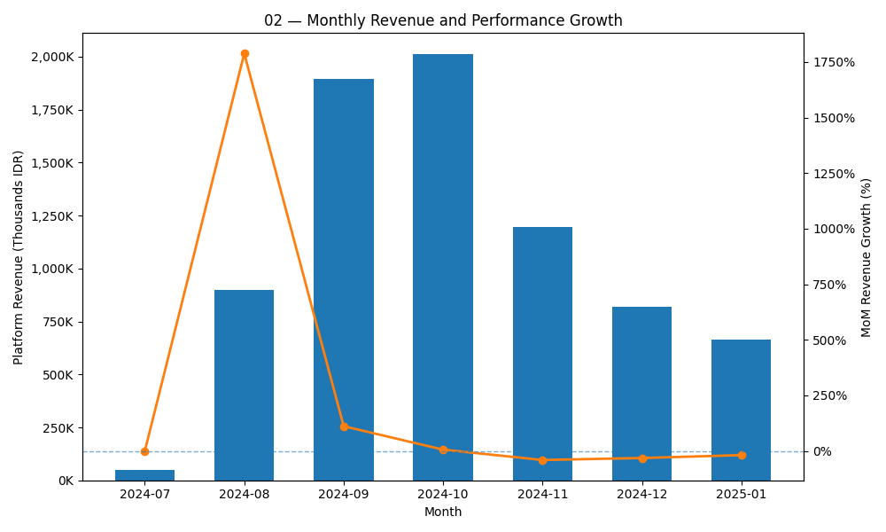

#### Key Insights
- Revenue increased quickly at the beginning, but that increase did not last.
- The pace of growth slowed almost right away after the first few months.
- Even though total revenue reached its highest point later, the business had already stopped gaining momentum by then.
- After October, revenue began to shrink month after month.
- This shows that the slowdown is not a one-time fluctuation, but a real change in direction.

  
---
  

### 03 — Revenue vs Transaction Volume  
**Business question:**  
*Is revenue growth driven by higher transaction volume, or by improved monetization efficiency?*

#### Method
- Aggregate monthly **transaction volume** using `net_amount`
- Aggregate monthly **platform revenue** using `fee_internal_amount`
- Group data by `year_month`
- Visualize:
  - **Bars:** total customer load / transaction volume (IDR)
  - **Line:** platform revenue (IDR)

  

#### Key Insights
- Revenue rises and falls together with how much money customers put into the platform.
- Both total usage and revenue reach their highest point in October, then drop at the same time.
- When usage goes down, revenue goes down as well.
- There is no sign that the platform is earning more from each transaction over time.
- This means revenue depends mainly on how active users are, not on higher fees or better pricing.

  
---
  

# Growth Quality

### 04 — Growth Quality: Acquisition vs Retention  
**Business question:**  
*Is platform growth driven by new user acquisition, or by retaining existing users over time?*

#### Method
- Classify customers each month:
  - **New:** first-ever transaction occurs in that month
  - **Returning:** customer has transacted in a prior month
- Count distinct customers by classification per `year_month`
- Visualize:
  - **Bars:** new customers
  - **Stacked bars:** returning customers layered on top

  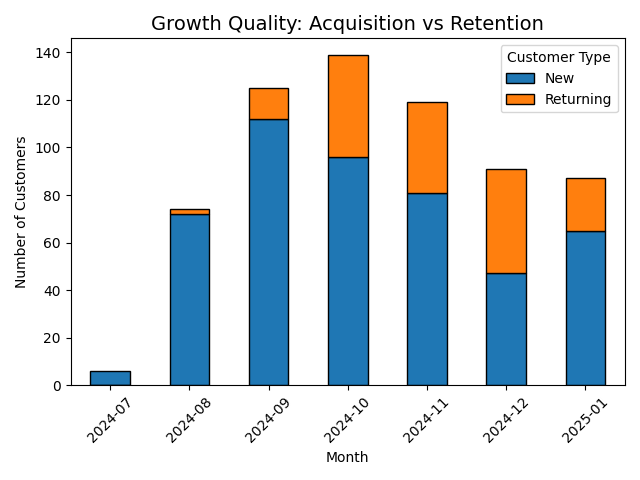

#### Key Insights
- Most of the early growth came from new users joining the platform.
- Users who came back did increase for a while, but they never became the majority.
- After October, both new sign-ups and returning usage dropped at the same time.
- This shows that many new users tried the platform once but did not keep using it.
- The platform did not build a steady base of repeat users.

  
---
  

### 05 — Customer Retention Quality by Acquisition Period  
**Business question:**  
*How well do different acquisition cohorts retain customers over time, and how quickly does churn set in?*

#### Method
- Assign customers to a **cohort month** based on their first-ever transaction
- Track customer activity month-by-month after acquisition
- For each cohort and cohort age:
  - Calculate **retention rate (%)**
  - Count **active users**
  - Sum **internal fee revenue**
- Visualize results as a cohort heatmap:
  - **Color:** retention percentage
  - **Text:** users retained and revenue generated per cohort cell
    

  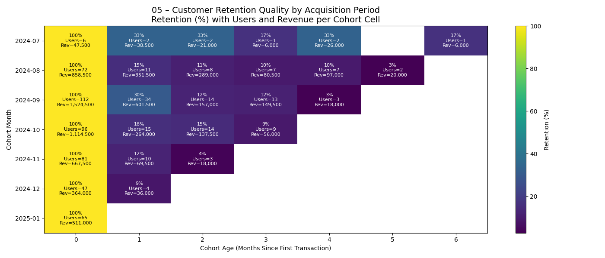

#### Key Insights
- Most customers stop using the platform soon after their first top-up.
- By the second or third month, only a small fraction of users are still active.
- Activity in later months comes from a very small group of users, not from most customers.
- Revenue continues for a short time because a few remaining users spend more, not because many users stay.
- No group of customers shows strong, long-lasting usage over time.

  
---
  

### 06 — Customer Value and Usage Segmentation  
**Business question:**  
*Which customer segments drive platform value, and how concentrated is usage?*

 

#### Method

 

**Per-customer metrics**

| Metric | Definition |
|------|-----------|
| **Top-up frequency** | Count of transactions (`id`) |
| **Average top-up amount** | Mean of `net_amount` |
| **Total top-up volume** | Sum of `net_amount` |

 

**Customer segmentation (by total top-up volume percentiles)**

| Segment | Definition |
|-------|------------|
| **Whales** | Top 5% |
| **High Value** | Next 15% |
| **Mass Market** | Middle 60% |
| **Long Tail** | Bottom 20% |

 

**Visualization encoding**

| Element | Meaning |
|-------|--------|
| **X-axis** | Top-up frequency |
| **Y-axis** | Average top-up amount |
| **Bubble size + color** | Value segment |

 

  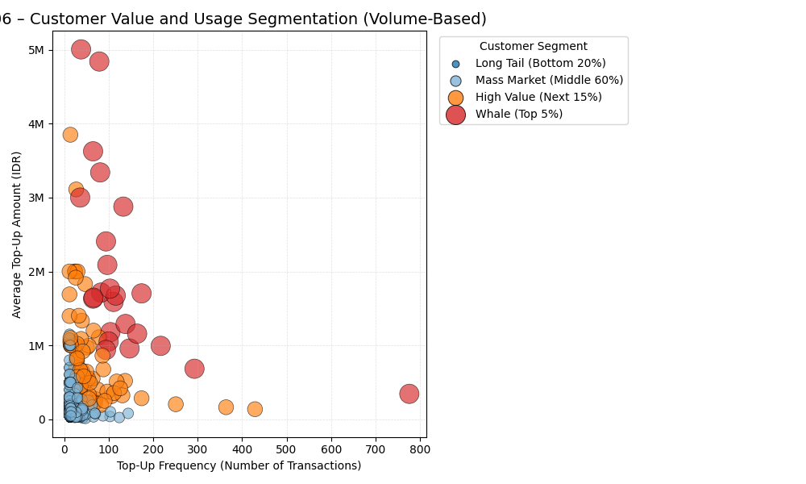

#### Key Insights
- A small number of customers contribute much more value than the rest.
- These high-value customers top up more often and in larger amounts.
- Most customers use the platform only occasionally and with smaller top-ups.
- Being a high-value customer requires both frequent use and large top-ups — not just one or the other.
- Because so much value comes from a small group, losing a few of these customers would have a noticeable impact. if top users churn

  
---
  

### 07 — Revenue Concentration and Whale Dependency  
**Business question:**  
*How concentrated is platform revenue, and how dependent is the business on high-value (“whale”) customers?*

#### Method

**Revenue concentration analysis**

| Step | Description |
|-----|-------------|
| 1 | Aggregate **total internal fee revenue** per customer (`fee_internal_amount`) |
| 2 | Rank customers from **highest to lowest revenue contribution** |
| 3 | Compute **cumulative % of customers** and **cumulative % of revenue** |
| 4 | Plot a **Pareto (Lorenz) curve** to assess concentration |

**Visualization encoding**

| Element | Meaning |
|--------|---------|
| **X-axis** | Cumulative % of customers (sorted by revenue contribution) |
| **Y-axis** | Cumulative % of total internal fee revenue |
| **Curve** | Revenue concentration across the customer base |
| **Dashed lines** | Reference points for Pareto threshold (e.g. 80% revenue) |

  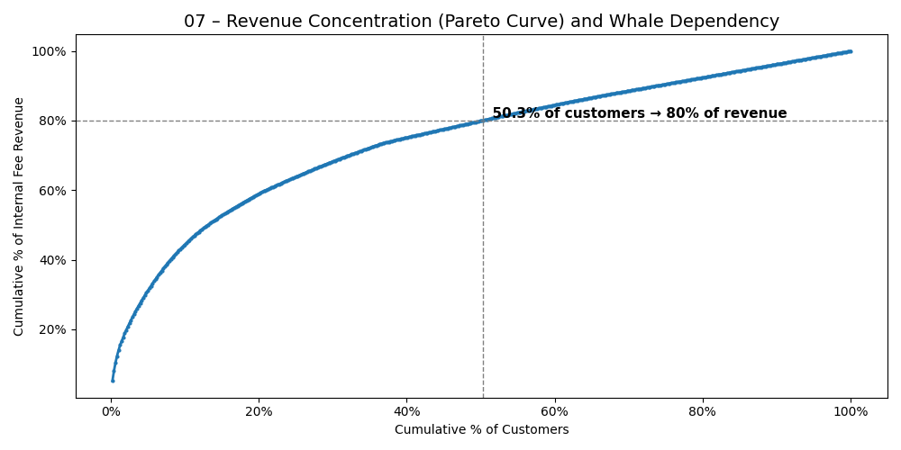

#### Key Insights

- Revenue concentration is moderate, not extreme (~50.3% of customers generate 80% of revenue)
- The platform does not follow a classic 80/20 Pareto pattern. About half of customers are responsible for most of the revenue, rather than only a small elite group.
- Both higher-value customers and regular users play an important role in total revenue.
- Revenue builds up gradually as more customers are included, instead of jumping sharply at the top.
- This means the business is not overly dependent on only a handful of users.

  
---
  

### 08 — Observed Customer Value  
**Business question:**  
*How is customer value distributed across the user base, and how concentrated is platform revenue?*

#### Method

**Observed customer value definition**

| Metric | Definition |
|------|------------|
| **Observed LTV** | Sum of `fee_internal_amount` per customer |
| **Revenue basis** | Internal platform fee only |
| **Observation window** | July 2024 – January 2025 |

**Distribution analysis**

| Statistic | Meaning |
|----------|---------|
| **Mean LTV** | Average customer value (outlier-sensitive) |
| **Median LTV** | Typical customer value |
| **P90 LTV** | Threshold for top 10% highest-value customers |

**Visualization encoding**

| Element | Meaning |
|--------|---------|
| **X-axis** | Observed LTV per customer (IDR) |
| **Y-axis** | Number of customers |
| **Vertical lines** | Mean, Median, and P90 reference values |

  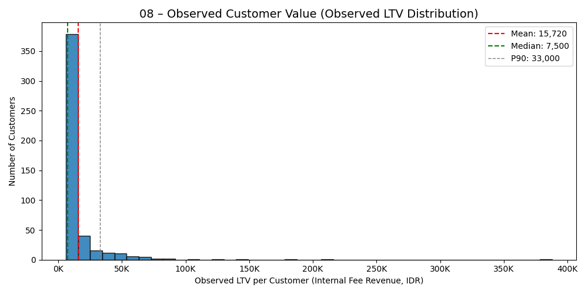

#### Key Insights

- Most customers generate a small amount of value.
- A much smaller group of customers generates far more value than the average user.
- The “typical” customer contributes relatively little compared to the top customers.
- A meaningful share of total revenue comes from the top 10% of users.
- This means the business depends more on high-value customers than on the average user.

  
---
  

### 09 — Customer Value Quality by Acquisition Period  
**Business question:**  
*Do customers acquired in different months generate similar long-term value, or does value quality deteriorate across cohorts?*

#### Method
- Assign each customer to a **cohort month** based on their first-ever transaction
- For each cohort:
  - Track **cumulative internal fee revenue per customer** over time
  - Measure value progression by **cohort age (months since acquisition)**
- Visualize:
  - **X-axis:** cohort age (months since acquisition)
  - **Y-axis:** cumulative customer value (internal fee revenue)
  - **Lines:** acquisition cohorts (by cohort month)

  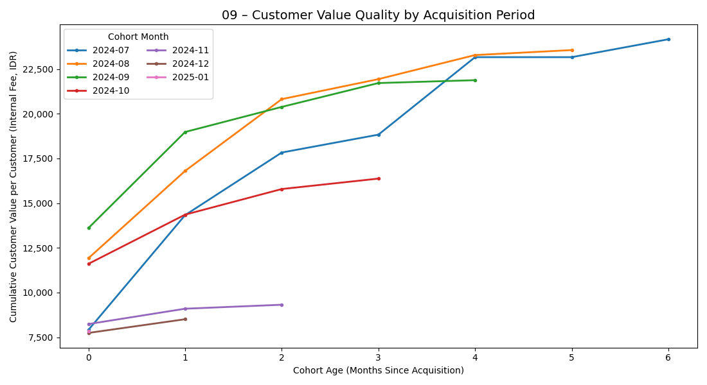

#### Key Insights

- Early cohorts (July–September) show strong cumulative value growth, reflecting higher-quality customers with durable long-term monetization
- Later cohorts (November–January) start lower and grow flatter, indicating declining customer value quality at acquisition rather than shorter observation windows
- Value accumulation slows for newer cohorts at comparable ages, showing weaker monetization even when customers remain active
- Revenue weakness reflects both retention and value decline, as fewer customers stay and each retained customer generates less value
- Scaling acquisition without quality control increases fragility, amplifying revenue risk instead of strengthening long-term growth

  
---
  

### 10 — Bank Market Share Dynamics
**Business question:**  
*How does customer top-up volume shift across partner banks over time, and what does this reveal about channel dependency and risk?*

#### Method
- Aggregate monthly top-up volume using net_amount
- Group transactions by year_month and bank category
- Compute monthly market share (%) for each bank : Bank monthly volume / Total platform volume (that month)
- Track market share changes over time for each bank partner

 

  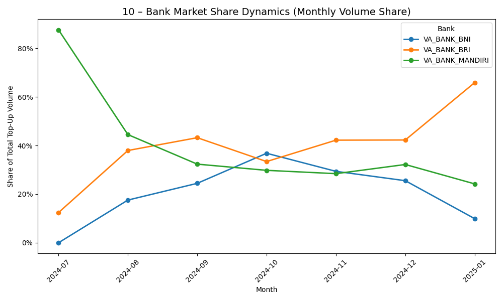

#### Key Insights
- At launch, most transactions went through Mandiri, meaning the platform relied heavily on one bank at the start.
- Over time, usage spread more evenly as BRI and BNI were added.
- BRI eventually became the most used bank, suggesting customers found it easier or more attractive to use.
- BNI saw a temporary increase in usage, but that increase did not last.
- After October, the mix of transaction volume across banks changed, rather than declining evenly across all banks.

  
---
  

### 11 - Current Customer Engagement Health (As of 2025-01)
**Business question:**  
*What is the current engagement state of the customer base, and how exposed is the platform to near-term churn risk?*

#### Method
- Define customer recency based on days since last transaction (as of January 2025)
- Classify customers into engagement segments:
  - Active: last transaction ≤ 7 days
  - At-risk: last transaction 8–30 days
  - Inactive: last transaction > 30 days
- Count customers per segment and compute percentage distribution

  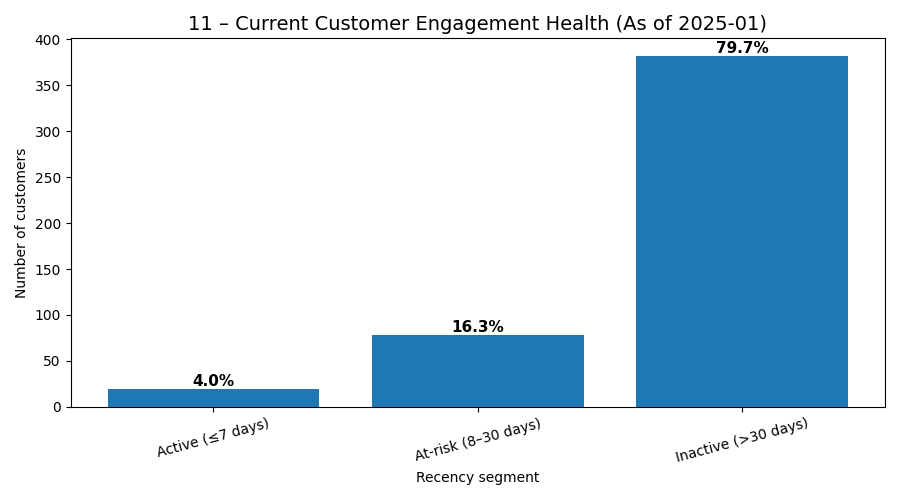

#### Key Insights

- Only a small fraction of customers are currently active, indicating weak short-term engagement
- A limited at-risk segment exists, suggesting most churn has already occurred rather than being imminent
- The majority of customers are inactive, pointing to a large disengaged base with low reactivation likelihood
- Engagement health is heavily skewed toward inactivity, not gradual decay

  
---
  

### 12 - Short-Term Trend Diagnostics Across Core Metrics
(Revenue • Transaction Volume • Active Users)

**Business question:**  
- Do recent trends in transaction volume, active users, and revenue point to renewed growth or continued contraction?
- Can simple trend-based extrapolation be trusted after a clear growth-to-decline shift?

  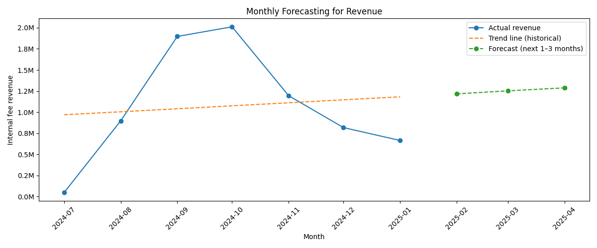

 

  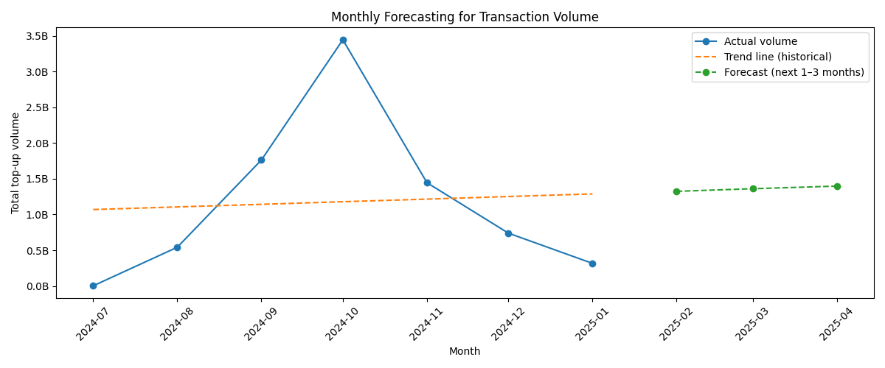

 

  

 

#### Key Insights

- Usage, active customers, and revenue all follow the same pattern: a fast rise at the beginning, followed by a steady decline.
- The early growth is so large that simple trend lines are pulled upward and do not reflect what is happening now.
- Looking only at these trends makes the situation appear healthier than it really is.
- Because the data covers only a short period of time, projecting future results from these trends would be unreliable.
- These trends are useful for understanding direction, but not for making decisions on their own.

  
---
  

### Recommendation 1 — Fix early customer drop-off before pushing growth

**Charts used and why:**
- Customer Retention Quality by Acquisition Period (Cohort heatmap)
- Growth Quality: Acquisition vs Retention

These charts show that most customers stop using the platform very quickly, often after their first month. Very few customers stay active long enough to matter for revenue.

Action:
Focus on getting new users to come back at least once or twice after their first top-up. Improve onboarding, reminders, and first-repeat incentives before spending more money on bringing in new users.

  

### Recommendation 2 — Slow down new user acquisition until retention improves

**Charts used and why:**
- Customer Value Quality by Acquisition Period
- Growth Quality: Acquisition vs Retention

Later customer groups generate less value per customer than earlier ones, even when they’ve been around for the same amount of time. This shows that adding more users right now does not automatically improve the business.

Action:
Reduce broad marketing spend and only keep acquisition channels that bring users who actually return. Measure success by repeat usage, not by sign-ups.

  

### Recommendation 3 — Protect high-value customers who drive a large share of revenue

**Charts used and why:**
- Customer Value and Usage Segmentation
- Revenue Concentration (Pareto Curve)
- Observed Customer Value Distribution
  
A relatively small group of customers generates a large portion of total revenue. Losing even a few of them would have an immediate impact on the business.

**Action:**
Identify customers who transact often or in large amounts and make their experience as smooth as possible. Prioritize reliability, support, and fewer friction points for these users.

  

### Recommendation 4 — Treat usage growth as the main revenue driver

**Charts used and why:**
- Revenue vs Transaction Volume
- Monthly Platform Usage Volume
- Monthly Revenue Performance

Revenue rises and falls almost exactly with how much money flows through the platform. There is no sign that the platform earns more per transaction over time.

**Action:**
Focus on getting users to transact more often and stay active longer. Revenue will not recover unless usage recovers.

  

### Simple executive takeaway
The business problem is not pricing or fees. It is that users do not stay active long enough. Improving early retention and protecting valuable customers matters more than adding new users.

